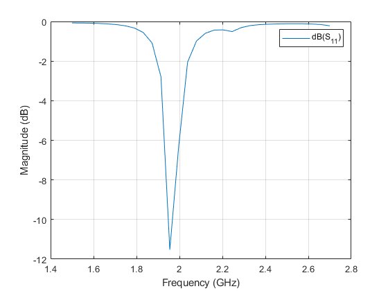
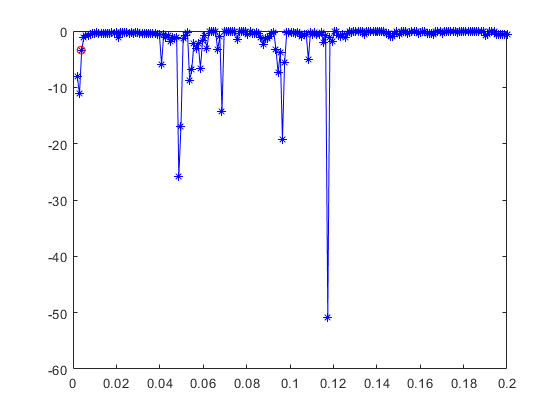

### Test S11 sulla nuova antenna

Antenna:
- L=0.0036
- W=0.07


Su 30 punti:

```matlab
freq_span=linspace(1.5e9,2.7e9,30);
S=sparameters(p,freq_span);
rfplot(S)
```
Risultati salvati in `S11_freq_spa.mat` e nelle figure `Gamma`.



### Test sulla mesh

Mi avvicino alla frequenza di risoanza
```matlab
f=1.955172413793104e9;

```

#### Test su 200 punti da 0.002 a 0.2 

Il codice è lo stesso del secondo refinement variando `mesh_val`.

Risultati salvati nella variabile `S11.mat` e nelle figure `S11` e  `S11_log` .



> Regione di stabilità tra 0.01 e 0.04 ? 

### Appronfisco lo studio concentrando i 200 punti tra 0.0011 e 0.057

```matlab
mesh_val=linspace(0.0011,0.057,200);
SS=zeros(1,length(mesh_val));
close all
meshconfig(p,'Manual');
for i=1:length(mesh_val)
   % figure()
mesh(p,'MaxEdgeLength',mesh_val(i));
%drawnow;
S=sparameters(p,f);
SS(i)=abs(S.Parameters);
i
name=strcat('mesh_',num2str(mesh_val(i)),'.pdf');
saveas(figure(1),name,'pdf');
close all
end
mesh_prop=meshconfig(p,'Auto');
S=sparameters(p,f);
SS_auto=abs(S.Parameters);
figure()
plot(mesh_val,SS,'b-*')
hold on
plot(mesh_prop.MaxEdgeLength,SS_auto,'r-o')
saveas(figure(1),'S11','pdf');

figure()
plot(mesh_val,20*log(SS),'b-*')
hold on
plot(mesh_prop.MaxEdgeLength,20*log(SS_auto),'r-o')
saveas(figure(2),'S11_log','pdf');
```
Nel ciclo vengono anche salvate le figure, questa volta nella cartella `refinement2`.