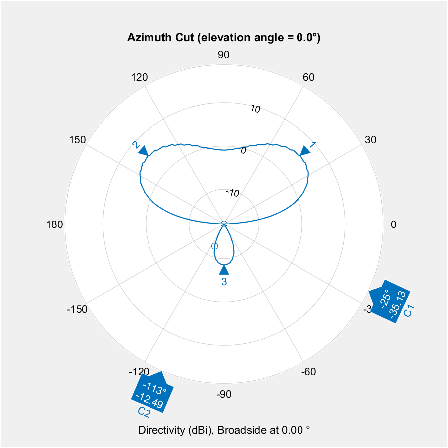

# Test with Sensor Array Analyzer

See [test_sensor_array](test_sensor_array.m) and [test_sensor_array](test_sensor_array_steering.m)

Used sensor array chebyshev coefficient
```mathematica
sll = 41;
Array.Taper = chebwin(5, sll);
```

or our coefficient

```mathematica
%sll = 41;
%Array.Taper = chebwin(5, sll);
Array.Taper=[0.1393  0.7215 1 0.7215 0.1393]';
```




# CI SONO DEI PROBLEMI CON IL PATCH

> Formula per $\epsilon_e$ errata -> CORREGERE!

Fatti ulteriori test con valori accettabili:

```matlab
p=pifa_antennaDesigner2;
h=0.0008;
epsr=4.8;
epseff=((epsr+1)/2+(epsr+1)/2)/(sqrt(1+12*h/W)); %costante dielettrica efficace
lambda=physconst('LightSpeed')/(f*sqrt(epseff));
lambda4=lambda/4;
p.Length = lambda4;
l = (p.Length)/2-0.01;
p.FeedOffset=[l 0];
close all
tic
meshconfig(p,'Manual');
mesh(p,'MaxEdgeLength',0.004);
close all
freq_span=linspace(1.9e9,2.3e9,50);
S=sparameters(p,freq_span);
rfplot(S)
toc
```

Ma non risuona dove serve!

> Trovare **errore** !!